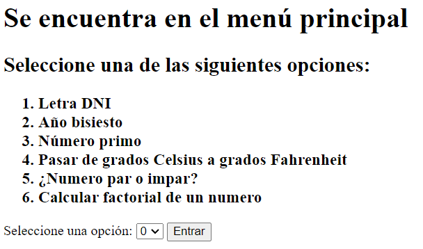

# StartPython - EOI Desarrollo Cloud

## ¿Quienes colaboran en este repositorio?

- Daniel Romero
- Pablo Vergel
- Monserrat Cabrera

## ¿Cuáles son las configuraciones locales requeridas?

1. **Clonar el repositorio**

```https://github.com/DanielRomero29/FinishingPython.git```

2. **Comprobar que la versión de Python instalada coincida con la del proyecto:**

Este proyecto usa la versión **Python 3.11.0**.

3. **Crear y activar el entorno virtual**

Desde Visual Studio Code, presionamos Ctrl+S+P para abrir la paleta, donde escribimos ```Python: Create Environment``` para crear un entorno virtual ".venv" con la versión **3.11.0**

4. **Instalar las librerias**

Ejecutar el comando ```pip install -r requirements.txt```

5. **Ejecución del programa**

Ejecutar el comando ```py appMain.py```

6. **Ejecución del programa de BBDD**

Ejecutar el comando ```py EjercicioBBDD.py```

## ¿Qué contiene este repositorio?

Este repositorio contiene un programa que permite ejecutar 6 ejercicios básicos en la web.

Además, hay un programa de BBDD para ejecutar

Los ejercicios corresponden con las siguientes cuestiones:

```markdown
1. Calcular la letra del DNI Español
2. Comprobar si un año es bisiesto
3. Comprobar si un número es primo
4. Pasar Grados Celsius a grados Farhenheit
5. Comprobar si un numero es par o impar
6. Calcular el factorial de un numero

```

Screenshot del funcionamiento del programa:



